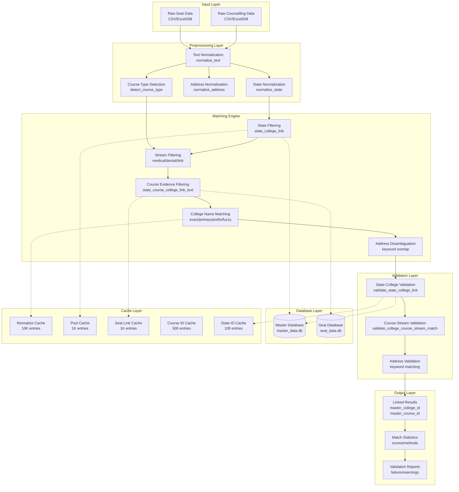
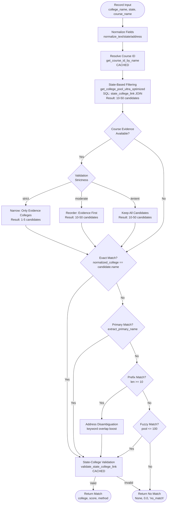
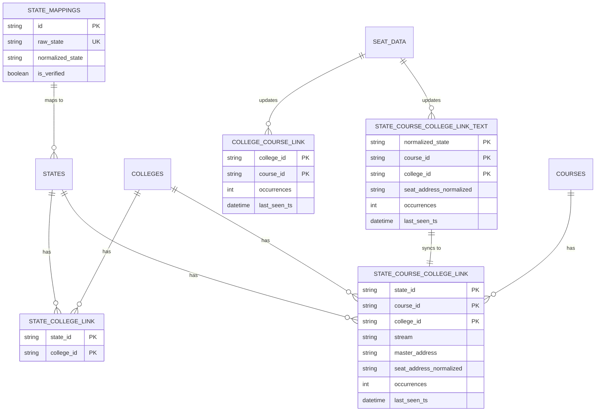
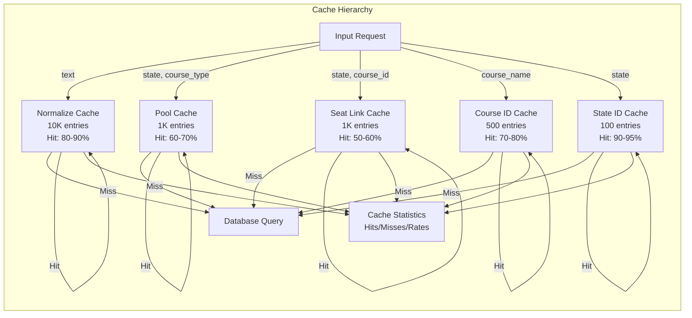
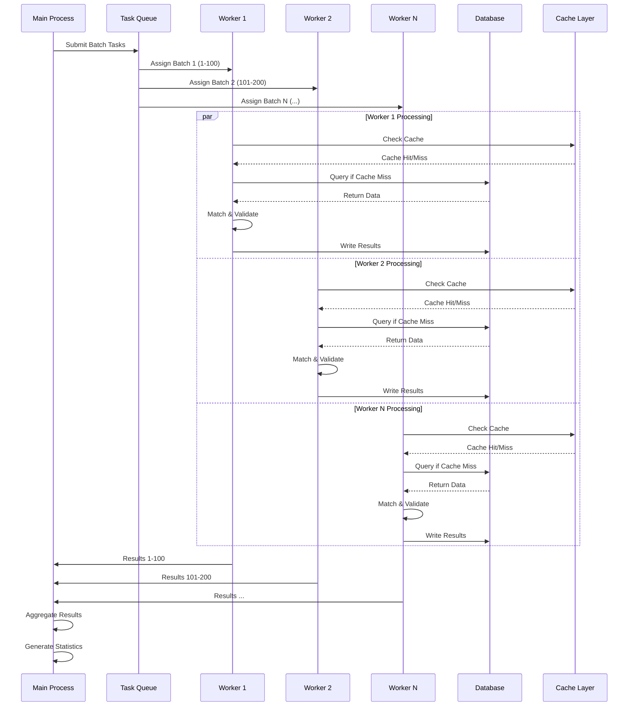
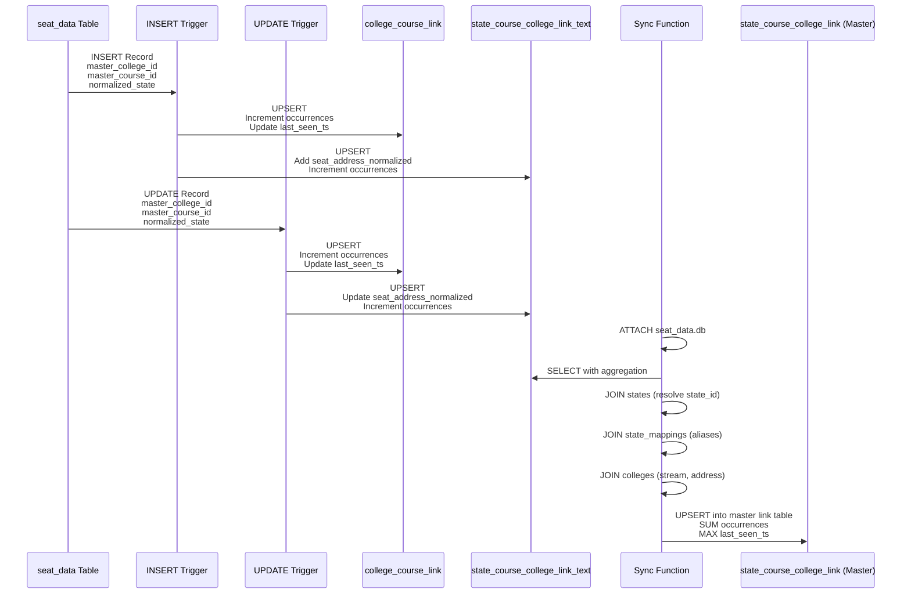
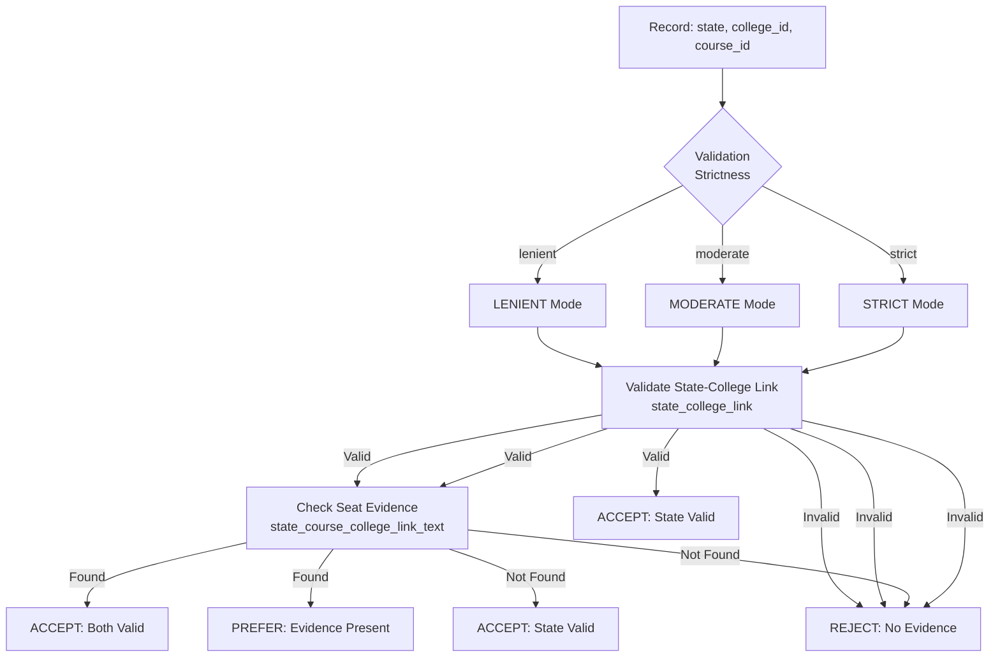
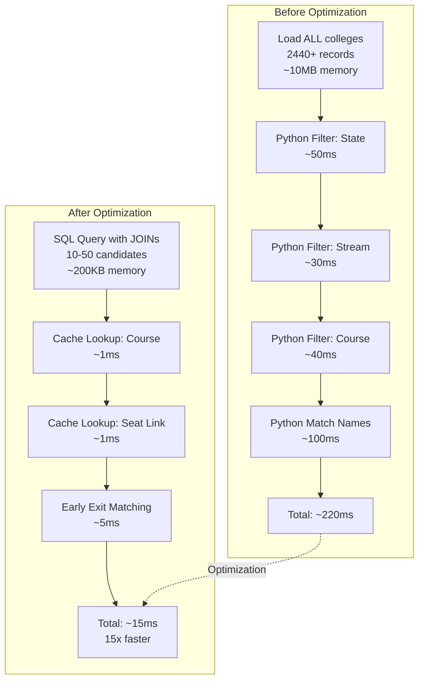
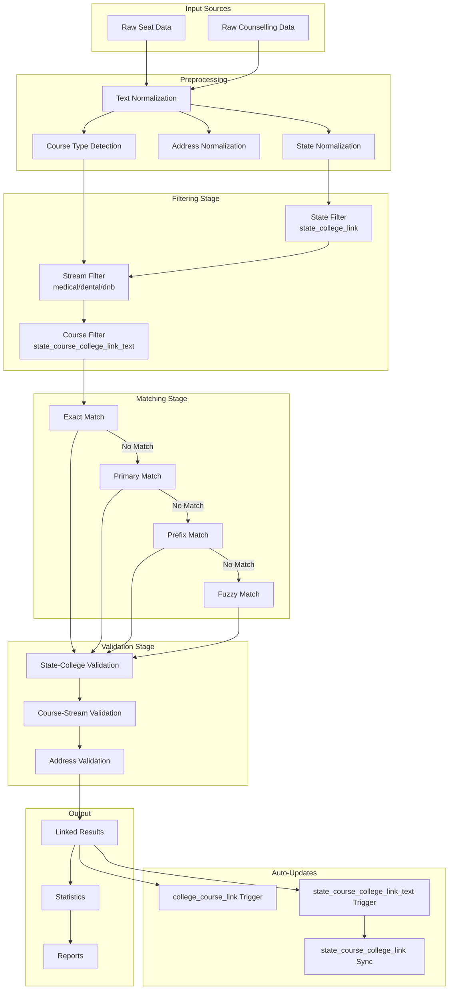

# Workflow Diagrams: Match and Link SQLite Seat Data System

## System Architecture Diagram

## Matching Workflow Diagram

## Database Link Table Architecture

## Cache Flow Diagram

## Batch Processing Flow

## Link Table Auto-Update Flow

## Validation Strictness Flow

## Performance Optimization Flow

## Complete System Data Flow

These diagrams provide a visual representation of the complete workflow, architecture, and data flow of the matching and linking system.

